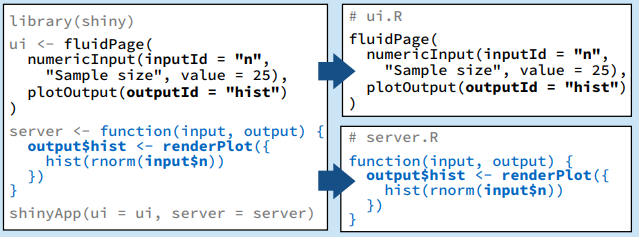
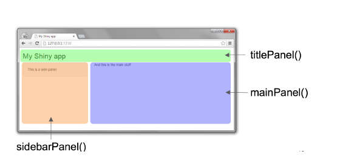
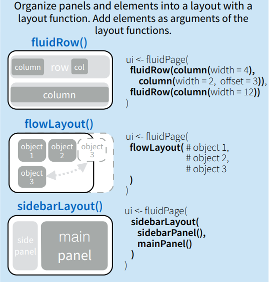
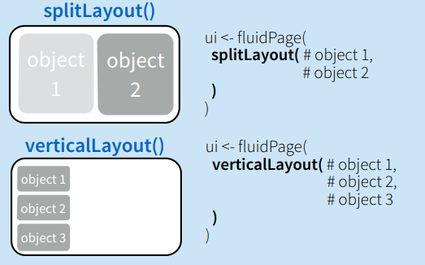
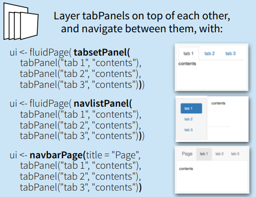

```{r setup, include=FALSE} 
knitr::opts_chunk$set(echo = FALSE)
```


```{r warning=FALSE, message=FALSE}
library(shiny)
library(shinydashboard)
library(dplyr)
library(DT)
library(plotly)
library(ggplot2)
library(openxlsx)
library(treemap)
library(gridBase)
library(CANSIM2R)

# We will get Table 36-10-0434-03: 
# Gross domestic product (GDP) at basic prices, by industry, annual average (x 1,000,000)
# From Statistics Canada

#gdp_raw<-readRDS("C:/Users/malaman/Documents/r_projects/csps/gdp_raw.rds")
gdp_raw <- getCANSIM(36100434, raw=TRUE)

# Cleaning the data:
gdp <- gdp_raw %>% 
  filter(Seasonal.adjustment %in% "Seasonally adjusted at annual rates")%>%
  select("time"="REF_DATE",            #use "X.U.FEFF.REF_DATE" for windows
         "naics"="North.American.Industry.Classification.System..NAICS.",
         "value"="VALUE", 
         "prices"="Prices") 

# Creating a new column time1 which will be a "date" object.
gdp$time1<-as.Date(paste((gdp$time), "-01", sep=""))

gdp$time1<-as.Date(gdp$time1)

##

```

## Executive Summary 


- Objective of the Shiny app
- Shiny app structure
- Sharing and hosting 
- Moving forward
- Questions

## What is shiny?


The  library is a open source R package from RStudio that allows users to build interactive web applications without the necessity to know any HTML, CSS or JavaScript.

The  library has extensive prebuilt widgets to create beautiful, responsive, and powerful applications with minimal effort 

It was developed mainly by Joe Cheng from RStudio.

## Benefits

The main benefits of using shiny over other tools are:

1. Interactivity.
2. Easy to share.
3. Relatively easy to develop (compared to other programing languages). 
4. Open source library with many excelent tutorials. (RStudio, StackOverflow, GitHub)
5. Fully customizable with HTML, CSS and/or JavaScript.


## Installing shiny

To install shiny we run:

```{r, eval=FALSE, echo = TRUE}
install.packages("shiny")
```

and then to load the library we just call:

```{r, eval=FALSE, echo = TRUE}
library("shiny")
```

The current version is 1.3.2.

## Structure

A folder contating a basic shiny application is structured in two different ways:

1. A folder that contains a file named myapp.R which includes the ui and server functions:

```
myapp              Name of the app
│   app.R             
└───data
│   └───data.csv   Data to use in the app
└───images
    └───image.jpg  Image to use in the app  
```

## Structure

The app.R file will contain a ui and server functions:

```{r, eval=FALSE, echo = TRUE}
library("shiny")

ui <- fluidPage()

server <- function(input, output){}

shinyApp(ui = ui, server = server)

```

## Structure


2. A folder that includes a ui.R and a server.R files:

```
myapp
│   ui.R
│   server.R  
└───data
│   └───data.csv
└───images
    └───image.jpg
```

runApp("C:/myapp")

## Structure



## Example of a shiny app
```{r, eval=TRUE, echo = FALSE}

library(shiny)

ui <- fluidPage(
  numericInput(inputId = "number", "Sample size", value = 25),
  plotOutput(outputId = "hist", height = "300px" )
)

server <- function(input, output) {
  output$hist <- renderPlot({
    hist(rnorm(input$number))
  })
  
}

shinyApp(ui=ui, server=server, options = list( height = "300px"))
```

##Example 2

```{r, echo=FALSE}
shinyApp(

  ui = fluidPage(
    selectInput("region", "Region:",
                choices = colnames(WorldPhones)),
    plotOutput("phonePlot")
  ),

  server = function(input, output) {
    output$phonePlot = renderPlot({
      barplot(WorldPhones[,input$region]*1000,
              ylab = "Number of Telephones", xlab = "Year")
    })
  },

  options = list(height = "200px")
)
```


## What is a ui?

The ui stands for **user interface** and it is the skeleton or layout of an application. The ui is where a dropdown menu, radio buttons, a slidebar should be located. 

The ui is written using shiny functions and its output is raw HTML code.

The main three functions which define the various regions of the ui are:

- headerPanel, 

- sidebarPanel, and 

- mainPanel 


## Layout of a shiny application




## What is a ui?

The ui is a HTML document:
```{r, eval=TRUE, echo = TRUE}
fluidPage(textInput("input_data","Select a province:"))
# <div class="container-fluid">
#   <div class="form-group shiny-input-container">
#     <label for="input_data">Select a province:</label>
#     <input id="input_data" type="text" class="form-control" value=""/>
#   </div>
# </div>
```

## Types of layout of a ui:



## Types of layout of a ui:



## Types of layout of a ui:



## Example

```{r, eval=FALSE, echo = TRUE}
library("shiny")
ui <- fluidPage(
  titlePanel("Hello Shiny!"), # App title ----
  sidebarLayout( #Sidebar layout with input and outputs 
    sidebarPanel( # Sidebar panel for inputs ----
      sliderInput(inputId = "bins", label = "Number of bins:",
                  min = 1, max = 50, value = 30)
    ),
    mainPanel(# Main panel for displaying outputs ----
      plotOutput(outputId = "distPlot")
    )
  )
)

```

## What is a server?

The server is a function that builds and rebuilds the R objects (plots, dataframes, images, text, datasets) specified in the ui. It accepts two parameters: input and output.

The server function allows users to interact with the application by rebuilding specific objects specified through the ui.

##Example

```{r, eval=FALSE, echo = TRUE}
server <- function(input, output) {
  # 1. It is "reactive" and therefore should be automatically
  #    re-executed when inputs (input$bins) change
  # 2. Its output type is a plot
  output$distPlot <- renderPlot({

    x    <- faithful$waiting
    bins <- seq(min(x), max(x), length.out = input$bins + 1)

    hist(x, breaks = bins, col = "#75AADB", border = "white",
         xlab = "Waiting time to next eruption (in mins)",
         main = "Histogram of waiting times")

    })
```

## User interface (ui) vs server

The ui is responsible for creating specific controls that a user can iteract with, while the server is translating the specific options selected in the ui into an actual plot, data, image, table, etc.


## Basic widgets in Shiny


##Shiny examples

Now let's explore some of the examples that one can create using shiny:

```{r, eval=FALSE, echo = TRUE}
library(shiny)

#In order to see all the examples:
runexample()

runExample("01_hello")
runExample("03_reactivity")
runExample("05_sliders")
runExample("09_upload")
```

## A note on reactivity

Shiny comes with a reactive programming library that you will use to structure your application logic. By using this library, changing input values will naturally cause the right parts of your R code to be reexecuted, which will in turn cause any changed outputs to be updated.

A reactive funtion is always defined with ({}), for example:

```{r, eval=FALSE, echo = TRUE}
  datasetInput <- reactive({
    switch(input$dataset,
           "rock" = rock,
           "pressure" = pressure,
           "cars" = cars)
  })
```

## Creating a shiny application

Steps:

1. Have an idea on which data to use and how to present it.
2. Get the data (webscraping, accesing a database).
3. Clean the data (Does the dataset contain NAs? Are strings saved as factors? Are integers saved as strings?).
4. Create a shiny application.
5. Share the application.
6. Listen to suggestions from users.
7. Improve the application.

## 1) Idea:

In this excercise, we will create a dashboard that visualizes Canadian GDP figures at the national level for all published NAICS (North American Industry Classification) industries.

We will use Table 36-10-0434-03 from Statistics Canada.

## 2) Getting the data:

```{r, eval=FALSE, echo = TRUE}

library(CANSIM2R)

# We will get Table 36-10-0434-03: 
# Gross domestic product (GDP) at basic prices, by industry, annual average (x 1,000,000)
# From Statistics Canada

gdp_raw <- getCANSIM(36100434, raw=TRUE)

```
## 3) Cleaning the data:
```{r, eval=FALSE, echo = TRUE}

library(dplyr)

# Print the first rows of the dataset
head(gdp_raw)
table04 = gdp_raw

# Verify how many unique variables exist in a given colum name 
unique(table04$Seasonal.adjustment)
unique(table04$Prices)
unique(table04$GEO)


```

## 3) Cleaning the data:
```{r, eval=FALSE, echo = TRUE}

# Cleaning the data:
gdp <- gdp_raw %>% 
  filter(Seasonal.adjustment %in% "Seasonally adjusted at annual rates")%>%
  select("time"="X.U.FEFF.REF_DATE",
         "naics"="North.American.Industry.Classification.System..NAICS.",
         "value"="VALUE", 
         "prices"="Prices") 

# Creating a new column time1 which will be a "date" object.
gdp$time1<-as.Date(paste((gdp$time), "-01", sep=""))
gdp$time1<-as.Date(gdp$time1)

typeof(gdp$value)

```
## *Reminder:

Before starting to code a shiny app, let's remember its layout


## User interface (ui)
```{r, eval=FALSE, echo = TRUE}
ui <- fluidPage(
  titlePanel("GDP Analysis"),
  sidebarLayout(
    sidebarPanel(  
      # selectInput allows users to choose a given industry ----
      selectInput(inputId = "industry",
                  label = "Select an industry:",
                  choices = unique(gdp$naics)), 
      # radioButtons allows users to choose a price measure ----
      radioButtons(inputId = "prices",
                   label = "Select price measure:",
                   choices = unique(gdp$prices))),
    mainPanel(plotOutput(outputId = "plot2", height = "400px", width = "500px"))))     # Main panel for displaying outputs 
server <- function(input, output) ({})
#shinyApp(ui=ui, server=server)
```

## Running the ui

```{r, eval=TRUE}
# Define UI for app that analyzes the GDP at the national level for all NAICS industries ----

ui <- fluidPage(
  
  # App title ----
  titlePanel("GDP Analysis"),
  
  # Sidebar layout with input and output definitions ----
  sidebarLayout(
    
    # Sidebar panel for inputs ----
    sidebarPanel(  
      
      # Input: selectInput allows users to choose a given industry ----
      selectInput(inputId = "industry",
                  label = "Select an industry:",
                  choices = unique(gdp$naics)), 
      
      # Input: radioButtons allows users to choose a price measure ----
      radioButtons(inputId = "prices",
                   label = "Select price measure:",
                   choices = unique(gdp$prices))
      
    ),
    
    # Main panel for displaying outputs ----
    mainPanel(
      
    )
  )
)

# Define server logic required to draw a plot ----
server <- function(input, output) ({
  
  })
  


# To run the app:

shinyApp(ui=ui, server=server)
```


## 4) Creating the shiny application:


```{r, eval=FALSE, echo = TRUE}

# Define server logic required to draw a histogram ----
server <- function(input, output) {
  output$plot2 <- renderPlot({
    
    dat <- gdp %>%
      filter(naics %in% input$industry ) %>%
      filter(prices %in% input$prices)
    
    ggplot(dat, aes(x= time1 , y= value, group=1))+
      geom_line()+
      theme(axis.text.x = element_text(size=11, angle=90))+
      scale_x_date(date_labels = "%b %y", date_breaks = "1 year")
  })
}

```


## 4) Creating the shiny application:


```{r, eval=TRUE}
# Define UI for app that analyzes the GDP at the national level for all NAICS industries ----

ui <- fluidPage(
  
  # App title ----
  titlePanel("GDP Analysis"),
  
  # Sidebar layout with input and output definitions ----
  sidebarLayout(
    
    # Sidebar panel for inputs ----
    sidebarPanel(
      
      # Input: selectInput allows users to choose a given industry ----
      selectInput(inputId = "industry",
                  label = "Select an industry:",
                  choices = unique(gdp$naics)), 
      
      # Input: radioButtons allows users to choose a price measure ----
      radioButtons(inputId = "prices",
                   label = "Select price measure:",
                   choices = unique(gdp$prices))
      
    ),
    
    # Main panel for displaying outputs ----
    mainPanel(
      
      # Output: Plot ----
      plotOutput(outputId = "plot2", height = "400px", width = "500px")
      
      
    )
  )
)

# Define server logic required to draw a histogram ----
server <- function(input, output) {
  

  # This expression will generate a plot that is wrapped in a call
  # to renderPlot to indicate that:
  #
  # 1. It is "reactive" and therefore should be automatically
  #    re-executed when inputs from the ui change
  #
  # 2. Its output type is a plot
  
  
  output$plot2 <- renderPlot({
    
    dat <- gdp %>%
      filter(naics %in% input$industry ) %>%
      filter(prices %in% input$prices)
    
    ggplot(dat, aes(x= time1 , y= value, group=1))+
      geom_line()+
      theme(axis.text.x = element_text(size=11, angle=90))+
      scale_x_date(date_labels = "%b %y", date_breaks = "1 year")

  })
  
}

# To run the app:

shinyApp(ui=ui, server=server)
```


## Modifying the server:

The app is interactive and shows only one industry. The aim of the following excercise is to modify the server to be able to plot different industries.

## Modifying the server:
```{r, eval=FALSE, echo = TRUE}
# Within the selectInput function of the ui, we add multiple=TRUE
# selectInput(inputId = "industry",
#         label = "Select an industry:",
#         choices = unique(gdp$naics), multiple=TRUE)
server <- function(input, output) {
  output$plot2 <- renderPlot({
    dat <- gdp %>%
      filter(naics %in% input$industry ) %>%
      filter(prices %in% input$prices)
    
    ggplot(dat, aes(x= time1 , y= value, colour=dat$naics))+ # replace group=1
      geom_line()+
      theme(axis.text.x = element_text(size=11, angle=90))+
      scale_x_date(date_labels = "%b %y", date_breaks = "1 year")
  })
}
```
## New shiny app:
```{r, eval=TRUE}
# Define UI for app that analyzes the GDP at the national level for all NAICS industries ----

ui <- fluidPage(
  
  # App title ----
  titlePanel("GDP Analysis"),
  
  # Sidebar layout with input and output definitions ----
  sidebarLayout(
    
    # Sidebar panel for inputs ----
    sidebarPanel(
      
      # Input: selectInput allows users to choose a given industry ----
      selectInput(inputId = "industry",
                  label = "Select an industry:",
                  choices = unique(gdp$naics), multiple=TRUE), 
      
      # Input: radioButtons allows users to choose a price measure ----
      radioButtons(inputId = "prices",
                   label = "Select price measure:",
                   choices = unique(gdp$prices))
      
    ),
    
    # Main panel for displaying outputs ----
    mainPanel(
      
      # Output: Plot ----
      plotOutput(outputId = "plot2", height = "400px", width = "500px")
      
      
    )
  )
)

# Define server logic required to draw a histogram ----
server <- function(input, output) {
  

  # This expression will generate a plot that is wrapped in a call
  # to renderPlot to indicate that:
  #
  # 1. It is "reactive" and therefore should be automatically
  #    re-executed when inputs from the ui change
  #
  # 2. Its output type is a plot
  
  
  output$plot2 <- renderPlot({
    
    dat <- gdp %>%
      filter(naics %in% input$industry ) %>%
      filter(prices %in% input$prices)
    
    ggplot(dat, aes(x= time1 , y= value, colour= dat$naics))+
      geom_line()+
      theme(axis.text.x = element_text(size=11, angle=90))+
      scale_x_date(date_labels = "%b %y", date_breaks = "1 year")

  })
  
}

# To run the app:

shinyApp(ui=ui, server=server)
```

## Now, using plotly:
```{r, eval=FALSE, echo = TRUE}
#Instead of using plotOutput in the ui we use plotlyOutput
 plotlyOutput("plot2", height = "400px", width = "400px")
#We also use renderPLotly instead of renderPlot in the server
server <- function(input, output) {
  output$plot2 <- renderPlotly({
    dat <- gdp %>%
      filter(naics %in% input$industry ) %>%
      filter(prices %in% input$prices)
    
    ggplot(dat, aes(x= time1 , y= value, color=dat$naics))+ # replace group=1
      geom_line()+
      theme(axis.text.x = element_text(size=11, angle=90))+
      scale_x_date(date_labels = "%b %y", date_breaks = "4 year")
  })
}

```
## Adding plotly
```{r, eval=TRUE}
# Define UI for app that analyzes the GDP at the national level for all NAICS industries ----

ui <- fluidPage(
  
  # App title ----
  titlePanel("GDP Analysis"),
  
  # Sidebar layout with input and output definitions ----
  sidebarLayout(
    
    # Sidebar panel for inputs ----
    sidebarPanel(
      
      # Input: selectInput allows users to choose a given industry ----
      selectInput(inputId = "industry",
                  label = "Select an industry:",
                  choices = unique(gdp$naics), multiple=TRUE), 
      
      # Input: radioButtons allows users to choose a price measure ----
      radioButtons(inputId = "prices",
                   label = "Select price measure:",
                   choices = unique(gdp$prices))
      
    ),
    
    # Main panel for displaying outputs ----
    mainPanel(
      
      # Output: Plot ----
      plotlyOutput(outputId = "plot2", height = "400px", width = "500px")
      
      
    )
  )
)

# Define server logic required to draw a histogram ----
server <- function(input, output) {
  

  # This expression will generate a plot that is wrapped in a call
  # to renderPlot to indicate that:
  #
  # 1. It is "reactive" and therefore should be automatically
  #    re-executed when inputs from the ui change
  #
  # 2. Its output type is a plot
  
  
  output$plot2 <- renderPlotly({
    
    dat <- gdp %>%
      filter(naics %in% input$industry ) %>%
      filter(prices %in% input$prices)
    
    ggplot(dat)+
      geom_line(aes(x= time1 , y= value, colour=dat$naics))+
      theme(axis.text.x = element_text(size=11, angle=90),
            legend.position = 'none')+
      scale_x_date(date_labels = "%b %y", date_breaks = "1 year")

  })
  
}

# To run the app:

shinyApp(ui=ui, server=server)
```
## 5) Sharing the application:

- Shiny hosting on shinyapps.io
- Ocean Digital (OD)
- Amazon Web Services (AWS)
- Microsoft Azure 
- Shiny Server

## Sharing and hosting 


A shiny app can also be uploaded to GitHub and can be opened locally in RStudio.

For example to open this [shiny app](https://kunov.shinyapps.io/consumer_price_index/) that the code is hosted at this 
[repository](https://github.com/manolo20/cpi_dashboard_StatCan/)


```{r, eval = FALSE, echo = TRUE} 

shiny::runGithub('manolo20/cpi_dashboard_Statcan')

```


## Resources

https://shiny.rstudio.com/images/shiny-cheatsheet.pdf

http://rstudio.github.io/shiny/tutorial/

https://shiny.rstudio.com/tutorial/

https://deanattali.com/blog/building-shiny-apps-tutorial/


## Shiny vs other tools

Shiny is a powerful tool but there are other tools to create dashboards such as Excel, Microsoft Power BI, Tableau, Dash (Python), HTML and CSS, JavaScript.


## Questions?

For any further <span style="color:blue">**questions or suggestions**</span> please contact me by e-mail: <br><br> manolo.malaver-vojvodic@canada.ca.


Thank you.

<div class="midcenter" >
  </img>
</div>


